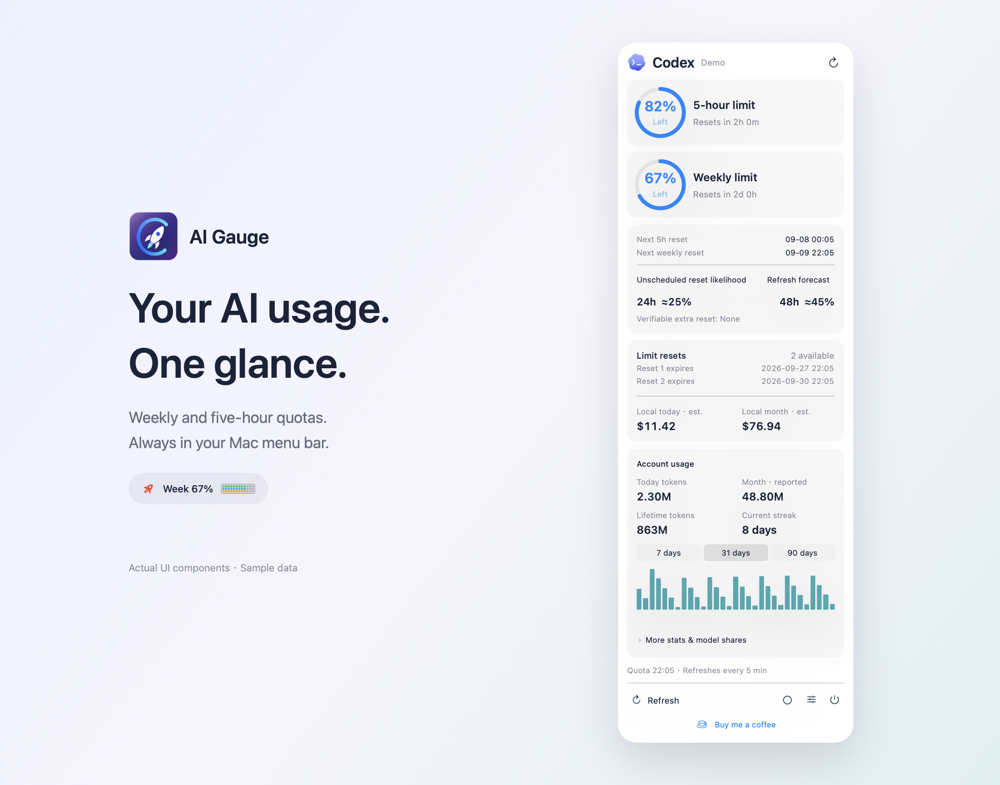
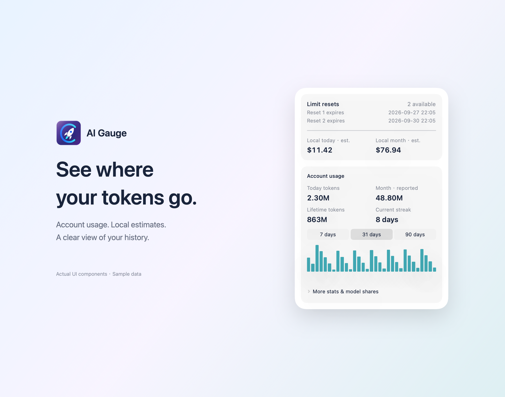
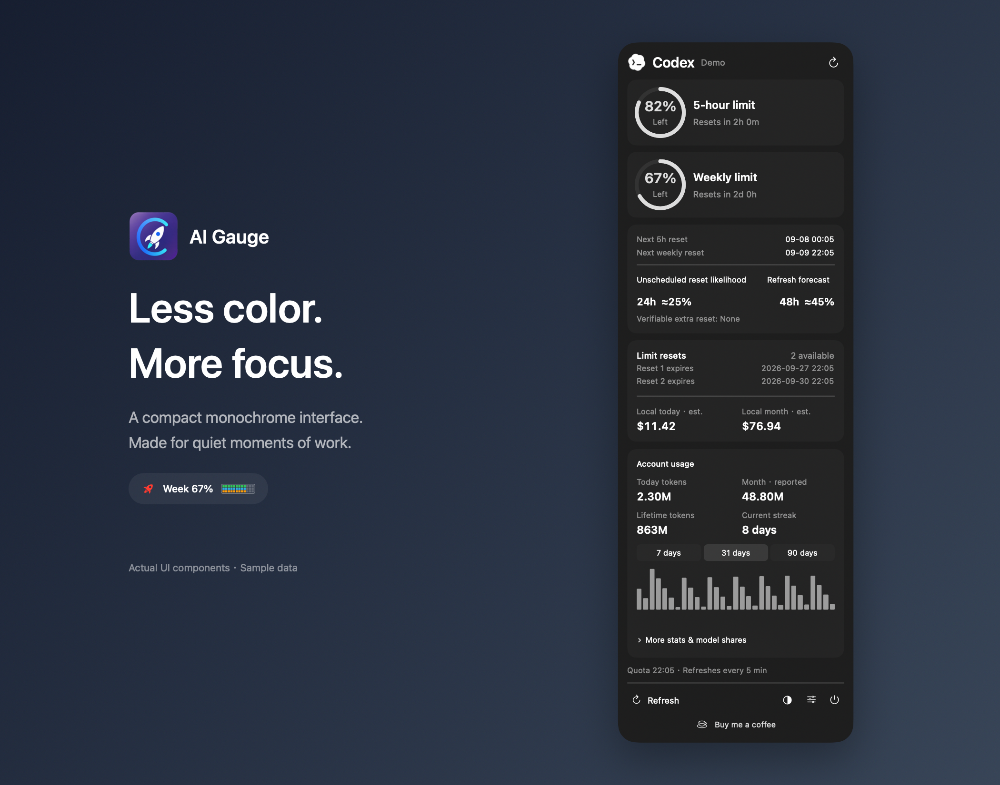

  
  <h1>AI Gauge</h1>
  
<strong>Your AI usage, at a glance.</strong>

  
Quotas, usage history, reset outlook, and calming sounds in your Mac menu bar.

  
<a href="#current-version">Current version</a> · <a href="#overview">Overview</a> · <a href="#install">Install</a> · <a href="#configuration">Configuration</a> · <a href="#privacy">Privacy</a> · <a href="README.zh-CN.md">简体中文</a>

  

    
    
    
    
  

Rendered from the current app’s native UI components with fictional account and usage data. The monochrome image uses an opaque background for consistent rendering; glass appearance varies with the desktop.

  
  

## Current version

**0.1.0 Beta · build 53.** Download the installer and SHA-256 checksum from the [Beta release](https://github.com/oliverxing2025/AI-Gauge-Downloads/releases/tag/v0.1.0-beta.53). AI Gauge is free to use; source code remains private.

The app contains both Apple Silicon and Intel executables and requires macOS 14 or later. This build is ad-hoc signed, **not Developer ID signed or notarized**. Intel, macOS 14, fresh-user installation, and all experimental account flows still need real-device acceptance.

See [release status](distribution/RELEASE_STATUS.md) and [changes](distribution/CHANGELOG.md). Do not treat the version badge as a public-release or notarization claim.

## Overview

| | Capability | What it does |
| --- | --- | --- |
| **01** | Quota at a glance | Menu-bar percentage and compact quota strip, with detailed quota rings. |
| **02** | Usage history | Account statistics when available, local token history, and API-equivalent cost estimates. |
| **03** | Reset outlook | Official reset timestamps plus a clearly labeled, experimental community forecast. |
| **04** | Live activity | A rotating rocket reflects Codex activity; optional background audio follows task state. |
| **05** | A quiet interface | Compact panel, monochrome glass mode, Chinese/English, and local display name/avatar. |

## Provider support

| Provider | Current scope | Verification boundary |
| --- | --- | --- |
| Codex | Subscription quota, account usage, local history, reset credits and activity | Local data path exercised; broader device acceptance pending |
| Claude | Claude Code / desktop quota and local usage | Experimental; complete real-account flow not fully accepted |
| Grok | Official CLI subscription quota | Experimental; real-account verification pending |
| DeepSeek | API balance and separately connected platform usage | Experimental; real-account verification pending |
| Kimi / WorkBuddy | Disabled placeholders | Not yet connected |

Activity-driven rocket states and background sounds currently follow **Codex only**. Missing data remains unavailable rather than becoming zero. API-equivalent cost estimates are not subscription charges; local history may include multiple accounts previously used on the same Mac. Community reset odds are not an official promise.

## Install

1. Download `AI Gauge.dmg` and `SHA256SUMS.txt` from the [Beta release](https://github.com/oliverxing2025/AI-Gauge-Downloads/releases/tag/v0.1.0-beta.53).
2. Verify the file with `shasum -a 256 -c SHA256SUMS.txt` from that folder.
3. Open the DMG and drag **AI Gauge** into **Applications**.
4. Open it from Applications, then eject the installation disk. Click the rocket in the top menu bar.

The current unsigned-by-Developer-ID beta may be blocked by macOS. Only after verifying the source, follow the system's Privacy & Security instructions. Do not disable Gatekeeper. Copy the complete DMG when transferring through Weiyun; credentials and history do not travel with the installer.

## Configuration

| Setting | Use |
| --- | --- |
| Select AI | Choose a provider and sign in or connect credentials locally. |
| Menu-bar quota | Select the weekly or five-hour window where supported. |
| White noise while running | Enable audio, compare 13 sound choices, and adjust volume. All existing recordings are preserved. |
| Appearance & language | Use the circle beside Settings for color/monochrome; choose language and local name/avatar in Settings. |
| Launch at login | Enable after moving the app to a stable installation location. |
| Privacy & licenses | Open the bundled privacy and license documents. |

Codex needs an installed and signed-in client. Claude reads an existing local Claude login. Grok uses the official CLI login. DeepSeek balance uses an API key; platform usage has a separate in-app login. Keys must never be pasted into an issue or sent to the developer.

## Troubleshooting

| Symptom | Check |
| --- | --- |
| No Dock window | AI Gauge is a menu-bar app; click its rocket icon. |
| Missing or stale quota | Confirm the selected provider is logged in, then refresh. Quota normally refreshes every five minutes. |
| Local history is empty | The selected client must have written supported local logs. Local statistics check for changes separately. |
| A feature fails on another Mac | Configure that Mac's account and permissions; credentials are not bundled. |
| The installer is blocked | This beta is not notarized. Verify the source and follow macOS guidance. |

Feedback should include the build, macOS version, chip type and reproduction steps. Redact account details and do not attach full logs or secrets.

## Privacy

No developer telemetry or advertising is included. Provider credentials are used for their respective service; DeepSeek keys and platform tokens are stored in the local Keychain. Local aggregates and preferences remain on the Mac. Public forecast requests do not contain your account or usage data.

Read the [privacy statement](distribution/PRIVACY.md) for per-provider destinations, storage and deletion instructions. Removing the app does not automatically delete preferences, caches or Keychain entries.

## Support

**Settings → Buy the author a coffee** opens the optional WeChat support window. Donations do not unlock features. Independent developer: **小奥**. No public international coffee link is configured.

## License & acknowledgements

AI Gauge is **free to use, closed source**. See [usage terms](distribution/TERMS.md). Third-party materials retain their own licenses; this project does not claim an MIT license for its proprietary code.

Thanks to [CodexBar](https://github.com/steipete/CodexBar), [VibeStick-Codex](https://github.com/oliverxing2025/VibeStick-Codex), SweetCookieKit and LobeHub. Individual audio authors and licenses are listed in [audio credits](assets/sounds/CREDITS.md) and [third-party notices](distribution/THIRD_PARTY.md). The original licensing basis for the preserved rain/cabin sources still needs independent confirmation before public distribution.

