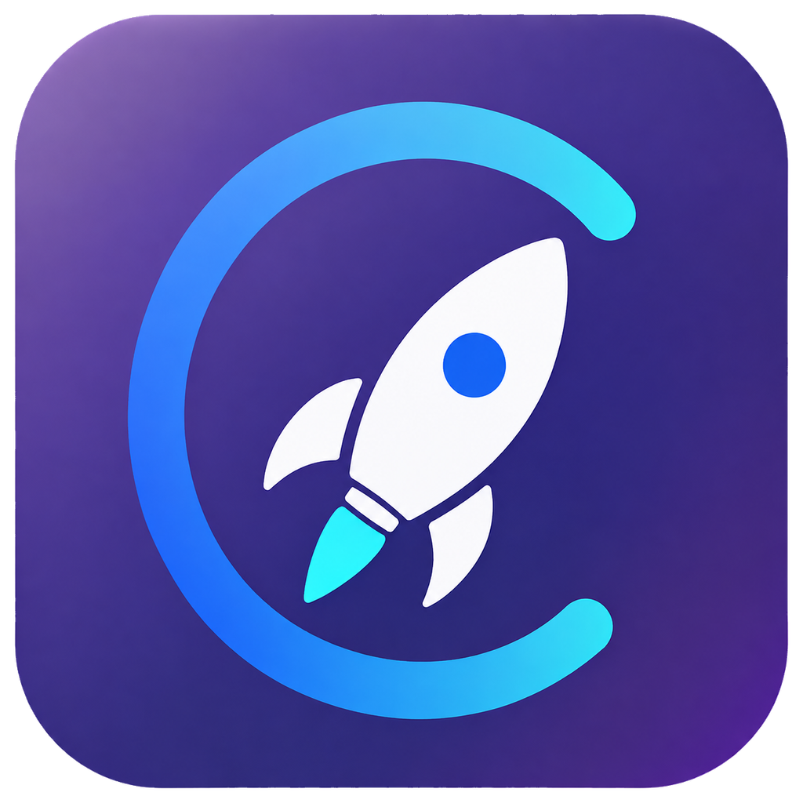
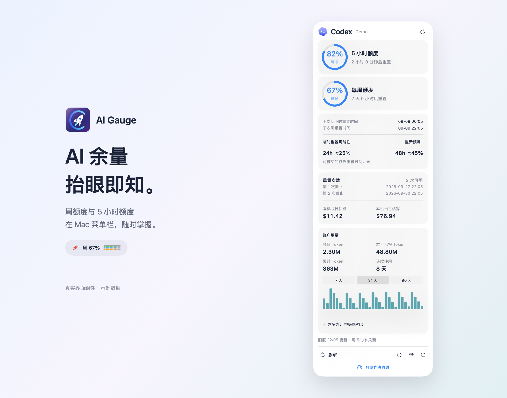
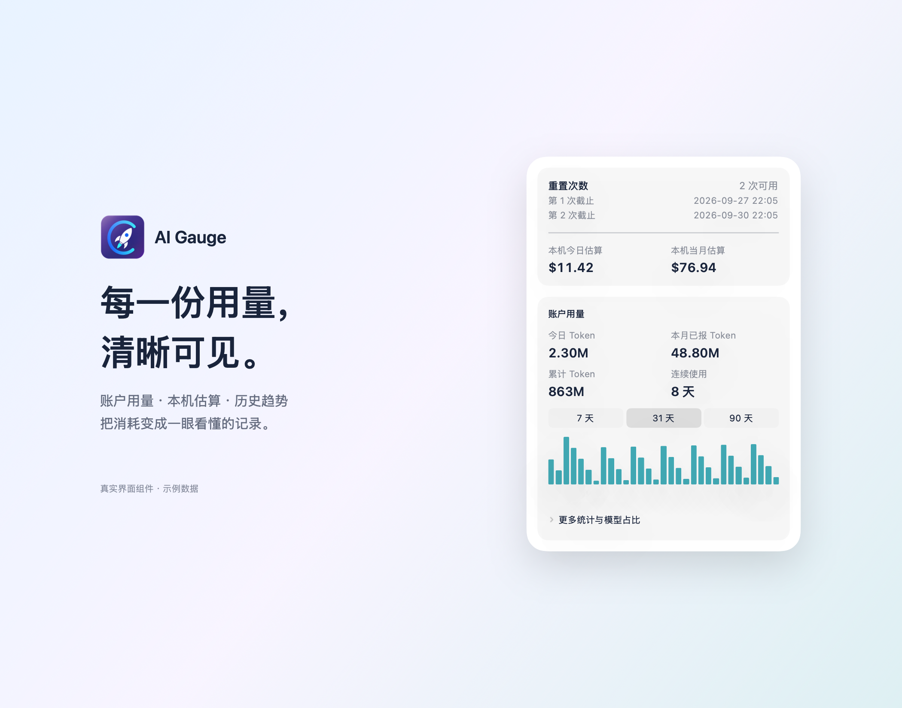
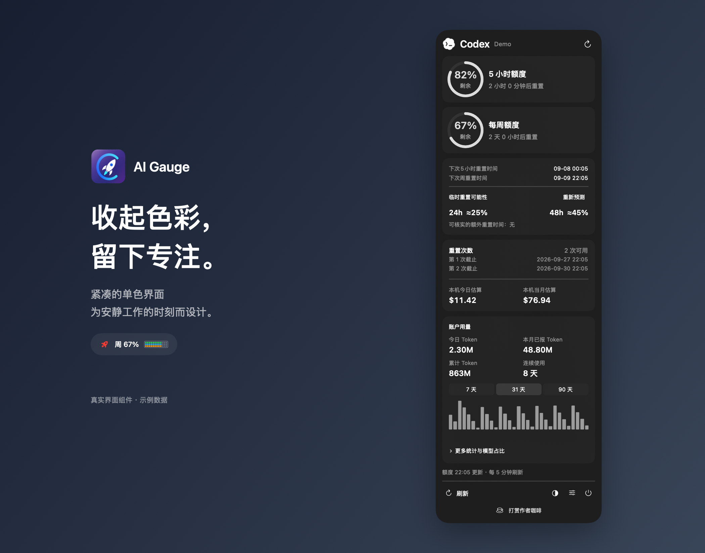

  
  <h1>AI Gauge</h1>
  
<strong>AI 用量与状态，一眼掌握。</strong>

  
额度、用量、重置预报与运行时白噪音 收进 Mac 顶部菜单栏。

  
<a href="#当前版本">当前版本</a> · <a href="#功能概览">功能概览</a> · <a href="#安装">安装</a> · <a href="#设置">设置</a> · <a href="#隐私">隐私</a> · <a href="README.md">English</a>

  

    
    
    
    
  

使用当前应用的原生界面组件渲染，账号及用量均为示例数据。单色图采用不透明背景以保持渲染一致，实际毛玻璃效果随桌面背景变化。

  
  

## 当前版本

**0.1.0 Beta · build 53**。从 [Beta 下载页](https://github.com/oliverxing2025/AI-Gauge-Downloads/releases/tag/v0.1.0-beta.53) 获取安装包和 SHA-256 校验文件。免费使用，源码保持私有。

安装包包含 Apple 芯片和 Intel 双架构，要求 macOS 14 或更高版本。当前为临时签名，**尚未完成 Developer ID 签名及 Apple 公证**。Intel、macOS 14、新用户首次安装及实验性账号流程仍需实机验收。

详见[发布状态](distribution/RELEASE_STATUS.md)与[更新记录](distribution/CHANGELOG.md)。Beta 下载不代表已完成签名公证或全部实机验收。

## 功能概览

| | 功能 | 使用体验 |
| --- | --- | --- |
| **01** | 额度一览 | 状态栏百分比与小方块额度条，点击展开额度圆环。 |
| **02** | 用量统计 | 可用的官方账户统计、本机 Token 历史和 API 等价费用估算。 |
| **03** | 重置预报 | 官方重置时间，以及明确标为参考信息的网友预测。 |
| **04** | 任务状态 | 火箭随 Codex 状态自转，运行时可播放白噪音。 |
| **05** | 简洁界面 | 紧凑面板、单色玻璃、中英文切换及本机名称与头像。 |

## AI 支持范围

| AI | 当前功能 | 验证情况 |
| --- | --- | --- |
| Codex | 订阅额度、账户用量、本机统计、重置券与任务状态 | 已验证本机数据路径，跨设备验收待完成 |
| Claude | Claude Code / 桌面版额度和本机统计 | 实验性，完整真实账号链路未全部验收 |
| Grok | 官方 CLI 登录后的订阅额度 | 实验性，真实账号验证待完成 |
| DeepSeek | API 余额及独立连接的平台用量 | 实验性，真实账号验证待完成 |
| Kimi / WorkBuddy | 灰显占位 | 暂未接入 |

火箭任务状态和运行时白噪音目前仅跟随 **Codex**。缺失数据显示不可用，不冒充零值。费用是 API 等价估算，不是订阅账单；本机日志可能包含不同账号时期的数据。网友重置预测不代表官方承诺。

## 安装

1. 从 [Beta 下载页](https://github.com/oliverxing2025/AI-Gauge-Downloads/releases/tag/v0.1.0-beta.53) 取得 DMG 与 `SHA256SUMS.txt`。
2. 在该文件夹执行 `shasum -a 256 -c SHA256SUMS.txt` 核对安装包。
3. 双击 DMG，将 **AI Gauge** 拖入 **Applications（应用程序）**。
4. 从应用程序中打开，再推出安装磁盘；点击顶部菜单栏的火箭查看面板。

当前测试版可能被 macOS 阻止首次打开。确认来源可信后，按系统“隐私与安全”提示处理，不要关闭系统安全保护。微云跨电脑同步请传输完整 DMG；安装包不包含个人登录信息和日志。

## 设置

| 设置项 | 用途 |
| --- | --- |
| 选择 AI | 选择服务，并在本机完成对应登录或连接。 |
| 菜单栏额度 | 支持的服务可选择每周或 5 小时额度。 |
| 运行时白噪音 | 开关、13 种声音和音量，支持反复选择对比；全部现有音频保留。 |
| 显示与语言 | 单色玻璃、中英文、本机名称与头像。 |
| 登录时启动 | 建议放入应用程序文件夹后再开启。 |
| 隐私与许可 | 查看随应用提供的隐私及第三方许可文件。 |

Codex 需要本机已安装并登录客户端；Claude 使用本机已有登录；Grok 使用官方 CLI 登录；DeepSeek 余额需要 API Key，平台用量需单独登录连接。不要把密钥贴到反馈或发给开发者。

## 常见问题

| 现象 | 处理方式 |
| --- | --- |
| 没有 Dock 主窗口 | 本应用运行在菜单栏，点击火箭即可。 |
| 额度缺失或过期 | 检查所选服务的本机登录，随后刷新；额度通常每 5 分钟更新。 |
| 本机统计为空 | 对应客户端需有支持格式的本机日志；统计独立增量更新。 |
| 换电脑后没有数据 | 在新电脑登录并配置权限，凭据不随安装包迁移。 |
| 系统阻止安装 | 当前 Beta 未公证；核实来源后按 macOS 提示处理。 |

反馈请附版本、macOS 版本、芯片型号与复现步骤。截图先遮挡邮箱；不要上传 API Key、Cookie、令牌或完整对话日志。

## 隐私

无开发者遥测与广告。各服务凭据仅用于相应服务；DeepSeek 密钥和平台令牌保存于本机钥匙串。本机聚合统计与偏好留在本机，公共预报请求不携带账户或用量数据。

完整读取范围、请求目标及删除方式见[隐私说明](distribution/PRIVACY.md)。删除应用不会自动删除偏好、缓存或钥匙串记录。

## 支持作者

设置 → **打赏作者咖啡**，可打开微信赞赏窗口。打赏自愿，不解锁付费功能。独立开发者：**小奥**。暂未配置海外咖啡平台链接。

## 许可与致谢

AI Gauge **免费使用，源码不公开**，详见[使用许可](distribution/TERMS.md)。第三方材料保留各自许可，不将整个项目标为 MIT 开源。

感谢 [CodexBar](https://github.com/steipete/CodexBar)、[VibeStick-Codex](https://github.com/oliverxing2025/VibeStick-Codex)、SweetCookieKit 和 LobeHub。音频作者及逐项许可见[音频来源](assets/sounds/CREDITS.md)与[第三方说明](distribution/THIRD_PARTY.md)。保留的雨声、机舱素材仍需独立核实原始授权依据后再公开分发。

